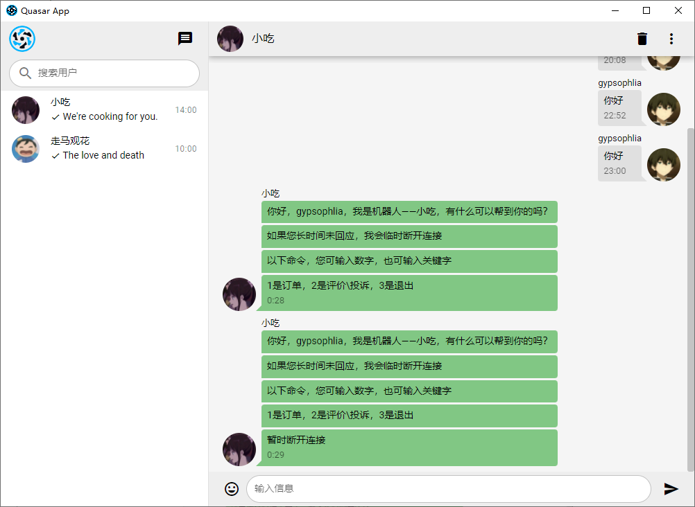

# **DSL 解释器的设计与实现**

## 引言

> 领域特定语言（Domain Specific Language，DSL）可以提供一种相对简单的文法，用于特定领域的业务流程定制。
>
> 定义一个领域特定脚本语言，这个语言能够描述在线客服机器人（机器人客服是目前提升客服效率的重要技术，在银行、通信和商务等领域的复杂信息系统中有广泛的应用）的自动应答逻辑，并设计实现一个解释器解释执行这个脚本，可以根据用户的不同输入，根据脚本的逻辑设计给出相应的应答。

本程序将模拟如下一个客服机器人场景：

某家餐厅在长久的经营下，营造了良好的口碑，每天三个时间段均门庭若市，为了区别其它订餐方式，商家决定不使用普通的订餐软件，而增设自己的订餐机器人，能够使得客户提前预约与订购事物，在此基础上的长远发展是，机器人可以为其自动排号，通知客户烹饪时间，就餐时间等，如此一来，节约了众多人力成本，也方便了客户。

## 概要设计

>注：同目录下的**`/server/doc/doc-page/index.html`**中包含着对服务端的注释文档，属于本文档的超集，可移步其查阅相关内容。

本程序开发的解释器以 NodeJs 为核心语言，模仿 Java 设计，对设计的 DSL 进行编译解析（Tokenize，Parse）生成 AST，再对其分析执行。

1. 借助 WebSocket 完成服务端与客户端的全双工通信（TCP）。
2. 借助 Electron 来开发简易的客户端交互界面。
3. 借助 Mocha/Chai 来完成单元测试。
4. 借助 Log4js 来完成日志记录。

## 架构图


## DSL 设计

客服机器人的 DSL 应该具备基本的开始与结束标识，整数与字符串变量类型，循环和判断逻辑，回复，监听，中断等。

### 例子

```js
var reply = ""
var name = outer

branch("start"){
    send("你好，我是机器人——小吃，有什么可以帮到你的吗？")
    listen(5,reply)
    detect(reply){
        match("预约|订餐|下单","order")
        match("投诉|评价","feedback")
        match("","exit")
    }
}
branch("order"){
    send("有以下食物，输入您要点的食物")
    listen(5,reply)
    detect(reply):
        match("牛肉汤")
}
branch("feedback"){
    send("若您有任何意见或看法，请告知我们")
    listen(5,reply)
    detect(reply):
        match("1")
}
brach("exit"){
    send("慢走，欢迎下次光临！")
    exit
}
```

### 作用域

该DSL中具备程序设计语言中的作用域概念，可进行嵌套。

在每层作用域中，将会将该层变量声明提前，对事件分支进行预处理。

声明提前的例子如下，借用了JS的思想。

```js
branch(){
	a = 1;
	var a;
}
```

### 记法

- 变量

  - 类型

    - 数字 Numeric
    - 字符串 String，其中字符串可通过`${}`来嵌套变量（借用JS的语法）

  - 声明

    此处变量声明包括两类变量，一种为内部变量，一种为外部变量（需要从外部导入）

    - 内部变量，只需赋值即可
    - 外部变量，必须通过`outer`关键字赋值


  ```
  var name = 1
  var name = outer
  var string = "Hello,${name}"
  ```

- 四则运算

  支持加减乘除运算，通过括号调整优先级。

  ```
  total = total + temp
  total = 2 * (3 + total)
  ```

- 事件分支

  此处事件分支可以进行嵌套，每次查询事件时，从内作用域到外作用域按顺序查询。

  ```
  branch(event1){
  	branch(event1.1){}
  	branch(event1.2){}
  }
  branch(event2){
  	branch(event2.1){}
  	branch(event2.2){}
  }
  ...
  ```

- 字符检测

  此处关键字为`detect`和`match`

  - `detect`参数为需要检测的源字符串
  - `match`参数有两个
    - 待匹配字符，其格式为字符串，字符串中可以通过`|`语法糖来放置多个匹配项，匹配一个即可跳转
    - 匹配成功后跳转的分支事件的名称

  ```
  detect(str){
  	match("好|可以|行",event1)
  	match(str2,event2)
  	match(str3,event3)
  }
  ```

- 发送消息

  此处message可输入字符串，也可输入变量

  ```
  send(message)
  ```

- 监听消息

  参数列表

  - seconds 监听的秒数，超时会触发`exit`函数
  - reply 监听内容回调赋值给reply（需提前定义该变量）

  ```
  listen(seconds,reply)
  ```

- 事件跳转

  ```
  goto(eventName)
  ```

- 退出

  ```
  exit()
  ```

## 详细设计

### 代码风格

此处通过`eslint`配置代码规范，采用较受欢迎的airbnb风格，见`.eslintrc.js`文件配置。

1. 缩进规范: 2个空格

2. 分号结尾（JS 语言对此无严格要求）

3. 字符串以单引号引用

4. 命名规范

   - 变量采用首字母小写的驼峰命名法，名词。

   - 常量采用均大小的下划线命名法，名词。

   - 函数采用首字母小写的驼峰命名法，动名词。

   - 类或模块采用首字母大写的驼峰命名法，名词。

### 数据结构

#### 字典

##### TOKEN

分词的结构，主要包含每个词的类型与值

```
// struct
{
	type: "",
	value: ""
}

// samples
{
  {
    "value": "var",
    "type": "KeyWord"
  },
  {
    "value": "reply",
    "type": "Identifier"
  },
  {
    "value": "=",
    "type": "Assign"
  },
  ...
}
```

##### AST

语法树的结构，需要为每种语法来定制其结构。

- 变量声明

  需包含变量声明的类型，并且在含有一个声明的变量数组，每个变量应该具备init属性，以表示其初始化时应具备的属性

  ```
      {
        "type": "VariableDeclaration",
        "declarations": [
          {
            "name": "reply",
            "init": {
              "source": "inner",
              "type": "string",
              "value": ""
            }
          }
        ]
      },
  ```

- 事件分支

  包含类型，事件名称（变量或字符串），以及该事件的作用域

  ```
  {
      "type": "BranchEvent",
      "name": {
          "value": "start",
          "type": "String"
      },
      "block": [
      	...
      ]
  }
  ```

- 字符串检测

  ```
  {
      "type": "BranchEvent",
      "name": “detect",
      "params": [
      	{
          	"value": "reply",
          	"type": "Identifier"
          },
          {
          	...
          }
      ],
      "block": [
      	...
      ]
  }
  ```

- 一些其它函数的结构统一定义为以下模式

  ```
  {
      "type": "Function",
      "name": "FUnctionName",
      "params": [
          {
              "value": "XXX",
              "type": "String"
          },
          {
          	...
          }
          ...
      ]
  }
  ```

##### MessageBox

消息的存储结构体

```js
// sender
{
    name: username,
    avatar: useravatar,
    time: nowtime,
    text: [...msg],
    sent: true,
}

// receiver
{
    name: username,
    avatar: useravatar,
    time: nowtime,
    text: [...msg],
    sent: false,
}
```

##### WSMessage

ws通信时传递的信息类型

```js
{
    type: "init",  // "message" or "close"
    data: {
        name: "xxx",
        avatar: "xxx",
        account: 100
    }
}
```

#### 栈

本项目中使用的栈结构与一般的栈无异，具备`push,pop,top,all`函数。主要用于处理作用域。

#### 其它

关于错误处理，在每个模块中，尤其是解析与运行模块中有规范的表示，将错误类型进行封装，如下：

```js
module.exports.ErrorProcess = {
  UnexpectedBranch(name) {
    throw new Error(`Branch Error: Unexpected branch ${name}`);
  },
  NotFoundDetect() {
    throw new Error('Detect Error: Not Found Detect');
  },
  NotFoundVariable(name) {
    throw new Error(`Variable Error: Not Found Variable ${name}.`);
  },
  EmptyVariable(name) {
    throw new Error(`Variable Error: The Variable ${name} is empty`);
  },
  TypeDismatch() {
    throw new Error('Type of both dismatches.');
  },
};
```

### 模块划分—服务端

#### 通信模块

通信模块使用**WebSocket**进行通信，划分为客户端与服务端。

客户端每次建立连接，后台ws服务即可监听收到的信号，并建立一个与之客户端对应的一对一的服务端，如下图，两个ws分别建立于服务端与客户端。

```js
// server.js
webSocketServer.on("connect",(ws)=>{
    ws.on("open",(res)=>{
        ws.on("message",()=>{
            ws.send("OK")
        })
    })
})

// client.js
ws = new WebSocket("ws://localhost:8080")
ws.onopen = (res)=>{
    ws.send("Client")
    ws.onmessage = (res)=>{}
}
```

在建立后，二者即可进行通信，通过`ws.send()`来发送消息，通过`ws.on("message",(res)=>{})`或者`ws.onmessage`来监听并接收消息。

由于服务端webSocketServer监听连接的建立，因此具备多线程，多用户的能力，其通信流程图如下： 


而在脚本文件设计的对应通信函数为`send(msg)`和`listen(seconds,event)`。

**关键点**：其中`send`的内部实现即可调用`ws.send()`；但是`listen`的实现由于需要等待指定的秒数，且在等待过程中，需要将进程阻塞，不能简单的使用`sleep`（JS中阻塞可通过异步Promise模块实现）来阻塞，因为阻塞时进程不会执行任何函数，于是此处需要使用一点技巧，可以将`seconds`分为多个时间片，每个时间片内阻塞，每个时间片结束则判断是否接受到消息，在所有时间片结束后仍未收到消息，即可退出程序。

#### 日志模块

日志的记录主要借助**Log4js**来实现。

**Log4js**可将运行过程中产生的重要记录写入日志文件中，记录中附带当前时间，同时按照日期分配文件。

```log
[2021-12-17T00:11:36.512] [INFO] default - Server compiled file test success.
[2021-12-17T00:11:36.518] [INFO] default - Server connected.(Port:8080)
```

日志文件主要存储在`/logs/XXX`中。

#### 解析模块

解析模块主要包括两部分，包括脚本进行分词，根据分词结果生成语法树。

- 分词 Token

  步骤：按行从文件中取出数据并根据状态转移图和已划分的关键字来完成，关键在于对状态的准确划分与错误的处理。其中为Tokenizer类定义了Judge基类，用以判断一些符号所属的类型（KeyWord，Identity…）。

  注意：当前token检测达到结束时，最后一个符号是否需要计入token中，此处通过state为99和100来区分，并分别处理。

  

- 语法树 AST

  步骤：按次读取分词结果的数组，处理的第一层从作用域入口或行函数分析，如遇到branch或detect，代表这是作用域入口；如遇到send或listen等，代表这是行函数。处理的第二层，则做针对性的状态转换，在该层需注意出口处理与错误处理。为了化简生成AST的过程，将branch，detect等设计为函数模式，通过括号来填写参数，因此在第二层中处理这些内置函数时，可共用处理参数的函数。

  注意：每一层分析的出入口管理应准确，作用域的层级划分应明确。

  关于作用域的处理尤为关键，这里需要使用栈结构来存储之前的作用域。若进入新作用域，则入栈；出作用域，则弹栈，调入上一个作用域。

#### 运行模块

运行模块对AST树进行解析并运行，每一个新开的客户端可直接解析AST以执行脚本。

分析思路即在生成AST树的基础上作改进，以实时执行函数。

**关键点**：

1. 在该部分需要特别处理作用域，每次进入一个作用域中需提前处理该作用域中的变量和分支，并将其各自存储在一个数组中，每次搜索，则可从后向前搜索，以此做到由内向外寻找需要变量和分支事件，符合作用域的特点；而每退出一个作用域后，将相应的变量和分支数组中的内容弹出。

2. 为了能够处理变量的运算，需要在生成AST树过程中，将四则运算的中缀表达式转换为后缀表达式（**波兰式**），在运行时，借助栈结构运行波兰式即可。
3. 为了处理字符串中的变量，此处需要借助正则表达式来分析字符串中所包含的`${}`的变量，并搜索当前变量表的变量值，以作替换。
4. 为了运行`listen`函数，需要构造`sleep`函数，并借助`async`和`await`语法糖来控制进程阻塞，此处用到类似时间片的技巧，具体已在通信模块中叙述。

#### 工具模块

工具模块，即为程序中需要使用到的一些工具函数和数据结构：

1. 日期函数，获取当天年月日，或时分的表达式。
2. 日志函数，用以配置日志的记录。
3. 睡眠函数，借助Promise封装阻塞函数。
4. 栈结构，具备栈的操作，在该程序中主要用于操作作用域。

### 模块划分—客户端

#### 通信模块

客户端通过`Electron`来创建，搭配Vue框架来完成页面设计，通过HTML5支持的`WebSocket`对象来实现对服务端ws地址`ws://localhost:8080`建立连接；服务端通过`Nodejs`来完成，使用`ws`模块来建立ws服务器，端口为8080。

具体通信流程图，见服务端的通信模块

#### 工具模块

1. 日期函数，获取当天年月日，或时分的表达式。
2. 防抖函数，用于对短时间内的多个同一操作进行延时，仅执行最好一次。
3. 改造的节流函数，用于对短时间内的多个同一操作进行延时，按某个时间间隔按次执行。

#### 存储模块

客户端的聊天记录存储采用localstorage本地存储，根据Message数据结构存储，并且可以自行删除其内容。

### 功能列表

服务端：

- 自定义samples目录下的test.gy文件，并启动后台程序执行脚本。

- 运行后可重新构建test.gy脚本并重新运行。

客户端：

- 多用户/多线程与机器人进行交互，快速得到回复。

- 可定制机器人，为机器人匹配相应的运行脚本。

## 接口

### 程序接口

关于解析模块与运行模块分别定义类，来有针对性支撑功能实现：

- Tokenizer

  通过processFile实现对文件的分词。

- Parser

  通过processAST实现对分词结果生成语法树

- Runner

  通过run实现对语法是的实时运行。

WebSocket通信接口中，在消息传送的基础上进行了JSON格式封装，能够处理三类通信：

- init

  初始化通信，客户端需要向服务端传输必备的基本信息，且脚本中的变量可以链接且修改改信息。

- message

  消息传送，人机交流的信息基础为消息的类型为`message`。

- close

  关闭通信，当人机交流结束，调用改接口来同步脚本中修改的客户端信息，如account。

### 人机接口

主要在于Electron的客户端进行人机操作。

1. 左侧**小吃**机器人和**走马观花**为目前的聊天用户，点击即可基于后台DSL脚本进行人机对话。

2. 在输入框中可与机器人进行交流，机器人默认响应20s，超时即会暂时退出。
3. 采用字符检测算法，每次通信可以输入响应的关键词或者对应的数字，二者均有效。
4. 右上角垃圾箱，可清除当前消息列表。



## 测试

测试部分注意使用**Mocha**测试框架和**Chai**断言库来实现。

该部分文件主要在`/test/*.spec.js`中。

### 测试桩

测试桩根据模块主要划分为五类，包括对解析模块，运行模块，通信模块，工具模块的测试：

- ws测试

  本项目第一步，需要测试建立的ws连接，包括服务端与客户端的点对点测试。

- token测试

  编写`test1.gy`，`test2.gy`，`test3.gy`文件，测试其生成的token分词的正确性，包括对变量声明，函数运行与作用域嵌套，四则运算的测试。

- parse测试

  分别对token中的三个文件生成的token分词文件`testX.token.json`进行解析，测试解析过程中的正确性。

- run测试

  分别对parse中的三个文件进行测试，借助ws模块，以检验运行过程是否正确。

- utils测试

  工具类测试，包括日期生成是否正确，睡眠函数封装是否正确，日志写入的测试。

### 测试运行

一次性测试全部文件

```
// shell
npm run unit
```

测试某个文件

```
// shell
npm test ./test/xxx.spec.js
```

